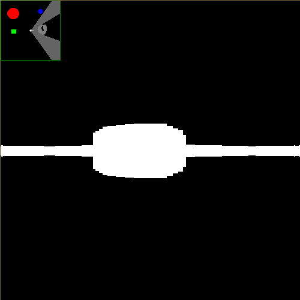

# Wolfenstein-ish Rendering Experiment in Processing

Simple raycasting demo like from the game [Wolfenstein](https://en.wikipedia.org/wiki/Wolfenstein). Map is defined from a top-down perspective in an image.

_Code written in high school- don't judge me ok._

